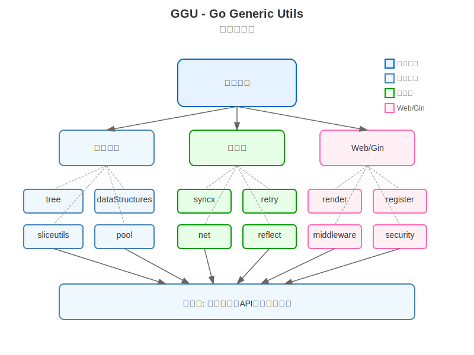

# GGU - Go Generic Utils

<p align="center">
  
  
  
</p>

GGU (Go Generic Utils) 是一个现代化的、基于泛型的 Go 语言工具库，专为高性能后端开发设计。利用 Go 1.18+ 引入的泛型特性，该库提供了各种实用的数据结构、算法和辅助工具，帮助开发者构建更高效、更可靠的应用程序。

## 📋 特性

- **泛型支持**：充分利用 Go 1.18+ 的泛型特性，提供类型安全的 API
- **模块化设计**：每个包都可以独立使用，也可以组合使用
- **高性能实现**：所有数据结构和算法都经过优化，适合高并发场景
- **完整测试**：全面的单元测试和基准测试
- **实用工具集**：涵盖日常开发中常用的功能和数据结构
- **中文友好**：全面的中文注释和文档
- **Web 开发支持**：与 Gin 框架深度集成

## 🏗 架构图

<p align="center">
  
</p>

GGU 遵循模块化设计原则，核心包括三大模块：

1. **数据结构模块**：提供高性能的树结构、切片工具和池化实现
2. **工具类模块**：提供同步原语增强、重试机制、网络工具和反射工具
3. **Web/Gin 模块**：提供 Gin 框架增强，包括路由注册、渲染工具、中间件和安全组件

这些模块共同为应用层提供全方位支持，适用于构建各类业务逻辑、API 服务和微服务。

## 🔍 项目结构

```
ggu/
├── bean/          - Bean 映射和转换工具
├── dataStructures/ - 高性能数据结构实现
├── example/       - 各模块使用示例
├── ginutil/       - Gin 框架增强工具
│   ├── binding/   - 请求绑定增强
│   ├── contextx/  - 上下文增强
│   ├── ecode/     - 错误码管理
│   ├── middleware/ - 中间件集合
│   ├── paginator/ - 分页工具
│   ├── register/  - 路由注册工具
│   ├── render/    - 响应渲染工具
│   ├── response/  - 响应格式化
│   ├── security/  - 安全相关工具
│   └── validate/  - 请求验证
├── internal/      - 内部实现
├── net/           - 网络相关工具
├── pkg/           - 通用包
├── pool/          - 对象池实现
├── reflect/       - 反射工具
├── retry/         - 重试机制
├── sliceutils/    - 切片操作工具
├── syncx/         - 同步原语增强
├── tree/          - 树数据结构
└── web/           - Web 开发工具
```

## 💻 安装

```bash
go get github.com/noobtrump/go-generic-utils
```

## 🧩 核心模块说明

### 🌲 tree - 树结构

`tree` 包提供了多种高性能树数据结构实现，支持各种查询、插入和删除操作。

**特点**：
- 完整实现 AVL 树、B 树等数据结构
- 专为电商场景优化的树结构
- 并发安全的操作
- 类型安全的 API

**适用场景**：商品分类管理、数据索引、搜索推荐引擎

```go
// 创建 AVL 树
tree, _ := tree.NewAVLTree[int, string](tree.IntComparator)

// 添加键值对
tree.Put(10, "商品A")
tree.Put(5, "商品B")
tree.Put(15, "商品C")

// 获取值
value, _ := tree.Get(10)
fmt.Println(value) // 输出: 商品A

// 遍历所有键值对
tree.ForEach(func(key int, value string) bool {
    fmt.Printf("键: %d, 值: %s\n", key, value)
    return true
})
```

### 🔄 sliceutils - 切片工具

`sliceutils` 包提供了丰富的切片操作工具，包括查找、过滤、映射等功能。

**特点**：
- 线程安全的切片实现
- 丰富的查找和过滤方法
- 元素去重和集合操作
- 类型安全的泛型 API

**适用场景**：数据处理、集合操作、批量处理

```go
// 查找元素
items := []int{1, 2, 3, 4, 5}
value, found := sliceutils.Find(items, func(x int) bool { return x == 3 })

// 过滤元素
evens := sliceutils.FindAll(items, func(x int) bool { return x%2 == 0 })

// 线程安全的切片
safeSlice := sliceutils.NewThreadSafeSlice([]string{"a", "b", "c"})
safeSlice.Append("d")
```

### 🔒 syncx - 同步工具

`syncx` 包提供了增强的同步原语和并发工具。

**特点**：
- 增强的互斥锁和读写锁
- 单次执行和延迟初始化
- 信号量和并发控制
- 高性能的并发数据结构

**适用场景**：并发控制、资源同步、性能优化

```go
// 创建单次执行函数
once := syncx.NewOnce()
once.Do(func() {
    // 只会执行一次的初始化代码
})

// 使用信号量控制并发
sem := syncx.NewSemaphore(10)
sem.Acquire()
defer sem.Release()
// 执行受限制的并发操作
```

### 🔁 retry - 重试机制

`retry` 包提供了灵活的重试策略和机制。

**特点**：
- 支持多种重试策略（固定间隔、指数退避等）
- 可自定义重试条件
- 超时控制
- 上下文集成

**适用场景**：网络请求、第三方服务调用、分布式系统通信

```go
// 创建重试器
retrier := retry.NewRetrier(
    retry.WithMaxAttempts(3),
    retry.WithBackoff(retry.ExponentialBackoff(100*time.Millisecond)),
)

// 执行可能失败的操作
result, err := retrier.Run(func() (interface{}, error) {
    return httpClient.Get("https://api.example.com/data")
})
```

### 🏊 pool - 对象池

`pool` 包提供了通用的对象池实现，帮助减少 GC 压力和内存分配。

**特点**：
- 泛型对象池实现
- 自动清理机制
- 可定制的对象创建和销毁
- 并发安全

**适用场景**：连接池管理、缓冲区复用、临时对象管理

```go
// 创建缓冲区对象池
bufferPool := pool.NewPool(
    func() *bytes.Buffer { return &bytes.Buffer{} },
    func(buf *bytes.Buffer) { buf.Reset() },
)

// 获取对象
buf := bufferPool.Get()
defer bufferPool.Put(buf)

// 使用对象
buf.WriteString("Hello, World!")
```

### 🌐 net - 网络工具

`net` 包提供了网络通信相关的工具和增强功能。

**特点**：
- HTTP 客户端封装
- 请求重试和超时控制
- 中间件支持
- 网络状态检测

**适用场景**：API 调用、服务间通信、网络状态监控

```go
// 创建增强型 HTTP 客户端
client := net.NewHTTPClient(
    net.WithTimeout(5*time.Second),
    net.WithRetry(3),
)

// 发送请求
resp, err := client.Get("https://api.example.com/data")
```

### 🍸 ginutil - Gin 框架增强

`ginutil` 包提供了对 Gin 框架的各种增强功能，使 Web 开发更加高效。

**特点**：
- 路由自动注册
- 标准化响应渲染
- 请求验证增强
- 错误处理和状态码管理
- 分页和排序支持

**适用场景**：RESTful API 开发、Web 服务构建、微服务开发

```go
// 使用 render 包构造标准响应
func GetUser(c *gin.Context) {
    user := fetchUser(c.Param("id"))
    
    if user == nil {
        render.NotFound(c, "用户不存在")
        return
    }
    
    render.Success(c, user)
}

// 使用自动注册功能
r := gin.Default()
ginutil.RegisterRoutes(r, UserController{})
```

## 📚 使用示例

### 树结构的应用

```go
// 价格区间查询
priceTree, _ := tree.NewAVLTree[float64, []string](tree.Float64Comparator)

// 添加商品ID到对应价格节点
priceTree.Put(5999.00, []string{"P001", "P002"})
priceTree.Put(4999.00, []string{"P003"})

// 查询价格范围内的商品
rangeKeys, rangeValues, _ := priceTree.FindRange(4000.00, 6000.00)
for i, price := range rangeKeys {
    fmt.Printf("价格 %.2f: %v\n", price, rangeValues[i])
}
```

### 并发安全的切片操作

```go
// 创建线程安全的切片
users := sliceutils.NewThreadSafeSlice([]User{
    {ID: 1, Name: "张三"},
    {ID: 2, Name: "李四"},
})

// 并发环境中安全操作
var wg sync.WaitGroup
for i := 0; i < 10; i++ {
    wg.Add(1)
    go func(id int) {
        defer wg.Done()
        users.Append(User{ID: id + 3, Name: fmt.Sprintf("用户%d", id+3)})
    }(i)
}
wg.Wait()

// 获取结果
allUsers := users.AsSlice()
fmt.Printf("总用户数: %d\n", len(allUsers))
```

### Gin API 开发

```go
func SetupRouter() *gin.Engine {
    r := gin.Default()
    
    // 配置标准响应渲染
    render.Configure(render.Config{
        JSONPrettyPrint: true,
    })
    
    // 注册 API 路由组
    api := r.Group("/api")
    {
        // 用户相关路由
        users := api.Group("/users")
        users.GET("", ListUsers)
        users.GET("/:id", GetUserByID)
        users.POST("", CreateUser)
    }
    
    return r
}

func ListUsers(c *gin.Context) {
    // 获取分页参数
    page, size := ginutil.GetPagination(c)
    
    // 获取用户列表
    users, total := getUserList(page, size)
    
    // 返回分页响应
    render.Paginated(c, users, total, page, size)
}
```

## 📈 性能基准

所有核心组件都经过基准测试，确保在高负载情况下的稳定性能。以下是部分组件的性能数据：

- **树结构**：AVL 树的查找、插入和删除操作均为 O(log n) 复杂度
- **切片工具**：优化的内存分配策略，减少垃圾回收压力
- **对象池**：减少对象创建和销毁的开销，显著提高内存使用效率
- **同步工具**：最小化锁竞争，提高并发性能

## 🛠️ 构建与测试

本项目使用 Makefile 简化构建和测试流程。详细的构建说明请参阅 [BUILD.md](BUILD.md) 文件。

### 常用命令

```bash
# 运行测试
make test

# 运行基准测试
make bench

# 代码格式化
make fmt

# 代码检查
make lint
```

## 🤝 贡献指南

我们欢迎任何形式的贡献！如果您想为项目做出贡献，请遵循以下步骤：

1. Fork 仓库
2. 创建您的特性分支：`git checkout -b feature/amazing-feature`
3. 提交您的更改：`git commit -m 'Add some amazing feature'`
4. 推送到分支：`git push origin feature/amazing-feature`
5. 提交 Pull Request

## 📄 许可证

本项目基于 Apache License 2.0 许可证开源 - 详见 [LICENSE](LICENSE) 文件

## 📞 联系我们

如有任何问题或建议，请通过以下方式联系我们：

- GitHub Issues: [https://github.com/noobtrump/go-generic-utils/issues](https://github.com/noobtrump/go-generic-utils/issues)
- 邮箱：steve1484121793@gmail.com